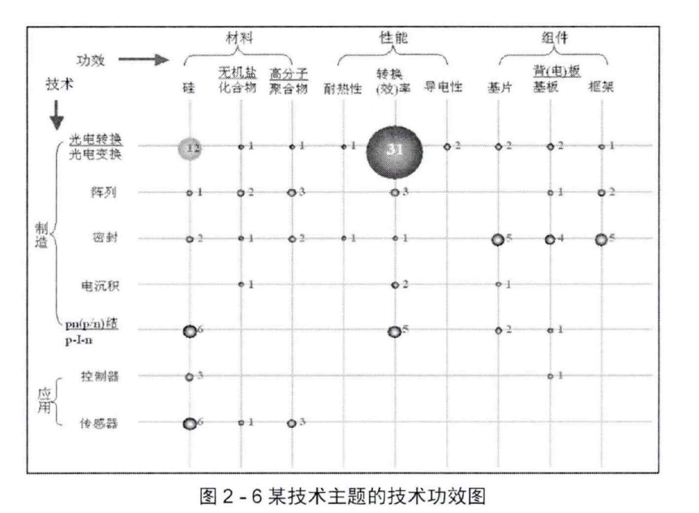
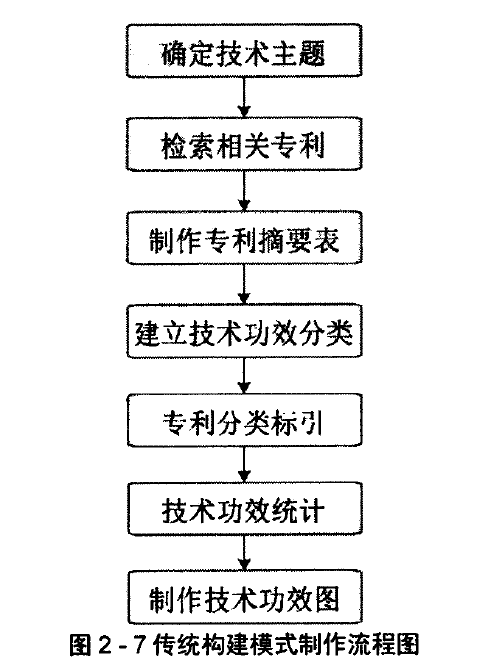
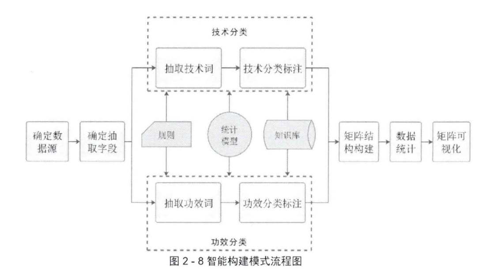

## Welcome to RogerJTX's Programming Notes

[editor on GitHub](https://github.com/RogerJTX/RogerJTX.github.io/edit/main/index.md) 

# My Main Notes Websites

Main Notes Website  
[https://rogerjtx.github.io/](https://rogerjtx.github.io/)

Word2Vector [ELMo, Bert, ALBert]    
[https://rogerjtx.github.io/word2vector.io/](https://rogerjtx.github.io/word2vector.io/) 

Topbase Knowledge Graph Paper Reproduction And Technical Documentation  
[https://rogerjtx.github.io/topbase_knowledge_graph/](https://rogerjtx.github.io/topbase_knowledge_graph/)

Automatic Code Generation [based on GPT-2]  
[https://rogerjtx.github.io/auto_code_generation/](https://rogerjtx.github.io/auto_code_generation/)

Comelot Table Image Recognition   
url:

Aminer Expert Knowledge Graph  
url:

Patent System Keyword Extractor    
url:

Expert Knowledge Graph KbpPipeline  
[https://rogerjtx.github.io/kbp_pipeline/](https://rogerjtx.github.io/kbp_pipeline/) 

Image Style Feature Fusion  
url:

Medical Image Recognition [COVID-19]    
url:

# Content：

1. [Introduce 介绍](#介绍)  
1. [Construction Method 专利技术图谱构建方法](#construction-method-专利技术图谱构建方法)  
1. [多种抽取模型](#多种抽取模型)  
1. [Result 实验结果](#实验结果)  

# Programming Notes Start

----------------------------------------

# 介绍

专利技术功效图可以直观的反映专利技术和功效的类别以及布局，主要用于研发人员的微观层面的技术分析。

技术图谱 和 功效图谱。

通过专利技术功效图，可判断哪些技术功效类别专利申请多，哪些技术功效分类对应区域申请专利少。申请专利多的区域，一般容易创新。

传统构建方法：
\

智能构建方法：
\

# 专利知识抽取方法

#### 1.

# Construction Method 专利技术图谱构建方法

