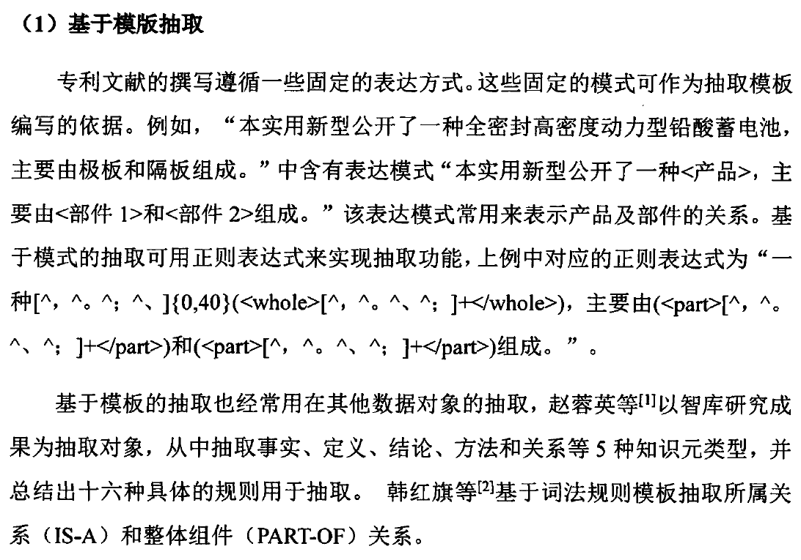

## Welcome to RogerJTX's Programming Notes

[editor on GitHub](https://github.com/RogerJTX/RogerJTX.github.io/edit/main/index.md) 

# My Main Notes Websites

Main Notes Website  
[https://rogerjtx.github.io/](https://rogerjtx.github.io/)

Word2Vector [ELMo, Bert, ALBert]    
[https://rogerjtx.github.io/word2vector.io/](https://rogerjtx.github.io/word2vector.io/) 

Topbase Knowledge Graph Paper Reproduction And Technical Documentation  
[https://rogerjtx.github.io/topbase_knowledge_graph/](https://rogerjtx.github.io/topbase_knowledge_graph/)

Automatic Code Generation [based on GPT-2]  
[https://rogerjtx.github.io/auto_code_generation/](https://rogerjtx.github.io/auto_code_generation/)

Comelot Table Image Recognition   
url:

Aminer Expert Knowledge Graph  
url:

Patent System Keyword Extractor    
url:

Expert Knowledge Graph KbpPipeline  
[https://rogerjtx.github.io/kbp_pipeline/](https://rogerjtx.github.io/kbp_pipeline/) 

Image Style Feature Fusion  
url:

Medical Image Recognition [COVID-19]    
url:

# Content：

1. [Introduce 介绍](#介绍)  
1. [Construction Method 专利技术图谱构建方法](#construction-method-专利技术图谱构建方法)  
1. [多种抽取模型](#多种抽取模型)  
1. [Result 实验结果](#实验结果)  

# Programming Notes Start

----------------------------------------

# 介绍

专利技术功效图可以直观的反映专利技术和功效的类别以及布局，主要用于研发人员的微观层面的技术分析。

技术图谱 和 功效图谱。

通过专利技术功效图，可判断哪些技术功效类别专利申请多，哪些技术功效分类对应区域申请专利少。申请专利多的区域，一般容易创新。

传统构建方法：
\

智能构建方法：
\

# 专利知识抽取方法

#### 1.介绍

研究了技术功效图的构成要素及其在专利文献中的分布位置和特征,若要把需要的“技术”、“功效”、“应用领域”等知识抽取出来，需要研究专利知识抽取的方法。

知识抽取在信息抽取之上。知识抽取比信息抽取多了语义组织的功能，除了像信息抽取一样把实体抽取出来，还要把抽取的实体组织起来，形成更有价值的信息。

根据前人对专利知识抽取的研究，常用的抽取方法有人工抽取专利知识、基于规则的专利知识抽取、基于统计模型的专利知识抽取和基于文本挖掘的专利知识抽取2]。以下分别对各种抽取方法进行研究，在此基础上研究针对技术功效图构建所需知识的抽取方法与策略。

#### 2.基于规则的抽取

专利有一定文本结构。常用的规则抽取方法是基于模板抽取和基于句法规则的抽取。

基于模板的抽取：

# Construction Method 专利技术图谱构建方法

